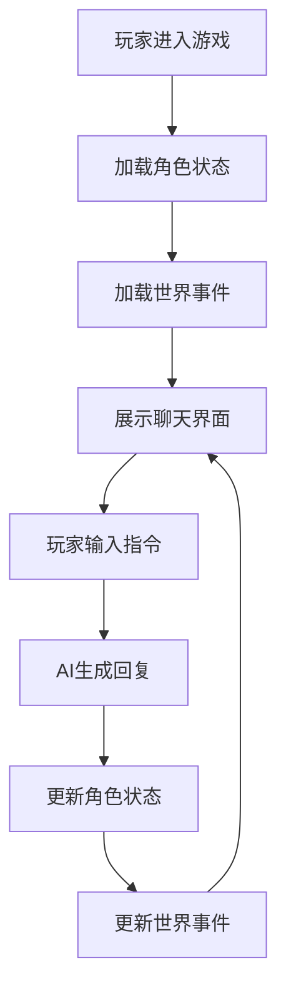

# 《青墟灵修志》游戏界面产品需求文档

## 1. 产品概述

《青墟灵修志》是一款沉浸式古风修仙文字游戏，玩家通过聊天交互方式体验修仙历程。游戏以真实时辰流逝、自由剧情抉择、慢节奏修仙养成为核心，AI动态生成全部游戏内容。

本页面为游戏主界面，采用聊天式交互设计，左侧展示角色状态与世界事件，右侧为主要聊天区域，玩家通过文字输入与AI进行交互推进游戏进程。

## 2. 核心功能

### 2.1 功能模块

1. **角色状态面板**：展示玩家角色信息、修为境界、属性数据
2. **世界事件面板**：展示当前世界动态、天气、灵潮等环境信息
3. **聊天交互区域**：核心游戏区域，展示对话历史与文字输入
4. **快捷操作栏**：提供常用指令快捷入口

### 2.2 页面详情

| 页面名称 | 模块名称 | 功能描述 |
|---------|---------|---------|
| 主界面 | 角色状态面板 | 展示角色名称、境界、灵根、属性、装备等 |
| 主界面 | 世界事件面板 | 展示当前时辰、天气、灵潮状态、世界动态 |
| 主界面 | 聊天区域 | 展示玩家与AI的对话历史，支持滚动查看 |
| 主界面 | 输入区域 | 文字输入框、发送按钮、快捷指令 |

## 3. 核心流程

## 4. 用户界面设计

### 4.1 设计风格

**整体风格**：古风修仙意境 + 现代简洁交互

- **主色调**：
  - 背景色：墨黑 `#0a0a0f` 渐变至深青 `#0d1f1f`
  - 主色：青玉色 `#2d5a5a` / `#3d7a7a`
  - 强调色：金色 `#c9a227`（用于境界、重要信息）
  - 文字色：米白 `#e8e4dc` / 淡青 `#a0c0c0`

- **字体设计**：
  - 标题字体：思源宋体 / Noto Serif SC（衬线体，古风韵味）
  - 正文字体：思源黑体 / Noto Sans SC（清晰易读）
  - 修为等级：特殊金色渐变字体

- **布局风格**：
  - 三栏布局：左侧状态栏(280px) + 中间聊天区(自适应) + 右侧事件栏(280px)
  - 聊天区域占主要空间
  - 圆角卡片式设计，带古风边框装饰

- **装饰元素**：
  - 祥云纹理背景
  - 水墨渐变效果
  - 古风边框（回纹、云纹）
  - 灵气流动动画效果

### 4.2 页面设计详情

#### 角色状态面板

| 元素 | 样式 | 说明 |
|-----|------|------|
| 角色头像 | 圆形，金色边框 | 显示角色形象 |
| 角色名称 | 金色大字，居中 | 玩家自定义名称 |
| 境界等级 | 渐变金色标签 | 如"炼气期·中期" |
| 灵根类型 | 青色标签 | 如"先天水灵根" |
| 属性条 | 进度条形式 | 生命、灵力、神识 |
| 装备栏 | 图标网格 | 武器、防具、饰品 |

#### 世界事件面板

| 元素 | 样式 | 说明 |
|-----|------|------|
| 时辰显示 | 圆形时钟图标+文字 | 如"子时·深夜" |
| 天气状态 | 图标+文字 | 如"晴朗·微风" |
| 灵潮指示 | 动态流光效果 | 显示灵潮强度 |
| 世界动态 | 滚动列表 | 近期发生的事件 |

#### 聊天区域

| 元素 | 样式 | 说明 |
|-----|------|------|
| 消息气泡 | 区分玩家/AI | 玩家右对齐，AI左对齐 |
| 角色标识 | 头像+名称 | 区分不同NPC |
| 消息时间 | 小字灰色 | 显示发送时间 |
| 特殊消息 | 居中，特殊背景 | 系统提示、剧情转折 |

#### 输入区域

| 元素 | 样式 | 说明 |
|-----|------|------|
| 输入框 | 圆角，深色背景 | 支持多行输入 |
| 发送按钮 | 金色渐变 | 圆形或圆角矩形 |
| 快捷指令 | 标签按钮 | 常用指令快捷入口 |

### 4.3 响应式设计

- **桌面端**：完整三栏布局
- **平板端**：隐藏右侧事件栏，可点击展开
- **移动端**：单栏布局，状态栏折叠为顶部条

### 4.4 动画效果

- **灵气流动**：背景微粒子缓慢飘动
- **消息进入**：淡入+上滑动画
- **境界突破**：金色光芒爆发效果
- **灵潮来临**：边框流光动画

## 5. 技术要求

- **框架**：React 18 + TypeScript
- **样式**：Tailwind CSS
- **状态管理**：Zustand
- **图标**：Lucide React
- **字体**：Google Fonts (Noto Serif SC, Noto Sans SC)
