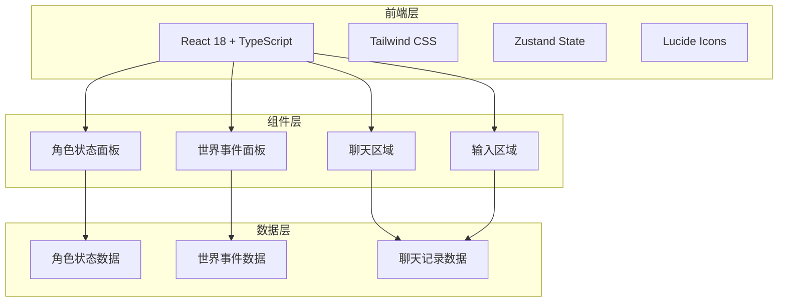

# 《青墟灵修志》技术架构文档

## 1. 架构设计



## 2. 技术栈

- **前端框架**：React 18 + TypeScript
- **构建工具**：Vite
- **样式方案**：Tailwind CSS
- **状态管理**：Zustand
- **图标库**：Lucide React
- **字体**：Google Fonts (Noto Serif SC, Noto Sans SC)

## 3. 路由定义

| 路由 | 用途 |
|-----|------|
| / | 游戏主界面 |

## 4. 组件结构

```
src/
├── components/
│   ├── CharacterPanel.tsx      # 角色状态面板
│   ├── WorldEventPanel.tsx     # 世界事件面板
│   ├── ChatArea.tsx            # 聊天区域
│   ├── ChatMessage.tsx         # 单条消息组件
│   ├── ChatInput.tsx           # 输入区域
│   ├── StatusBar.tsx           # 属性条组件
│   └── QuickActions.tsx        # 快捷操作栏
├── stores/
│   ├── gameStore.ts            # 游戏状态管理
│   └── chatStore.ts            # 聊天状态管理
├── types/
│   └── index.ts                # TypeScript类型定义
├── utils/
│   └── helpers.ts              # 工具函数
├── App.tsx
└── main.tsx
```

## 5. 数据模型

### 5.1 角色状态类型

```typescript
interface CharacterState {
  name: string;
  realm: string;           // 境界
  realmStage: string;      // 境界阶段
  spiritRoot: string;      // 灵根
  level: number;
  health: number;
  maxHealth: number;
  mana: number;
  maxMana: number;
  spirit: number;
  maxSpirit: number;
  equipment: Equipment[];
}
```

### 5.2 世界事件类型

```typescript
interface WorldState {
  time: string;            // 时辰
  weather: string;         // 天气
  spiritTide: boolean;     // 灵潮状态
  spiritTideIntensity: number;
  events: WorldEvent[];
}
```

### 5.3 消息类型

```typescript
interface ChatMessage {
  id: string;
  sender: 'player' | 'npc' | 'system';
  senderName?: string;
  content: string;
  timestamp: number;
  type: 'normal' | 'event' | 'system';
}
```

## 6. 状态管理

使用 Zustand 进行状态管理，分为两个主要store：

1. **gameStore**：管理角色状态、世界事件
2. **chatStore**：管理聊天记录、输入状态
